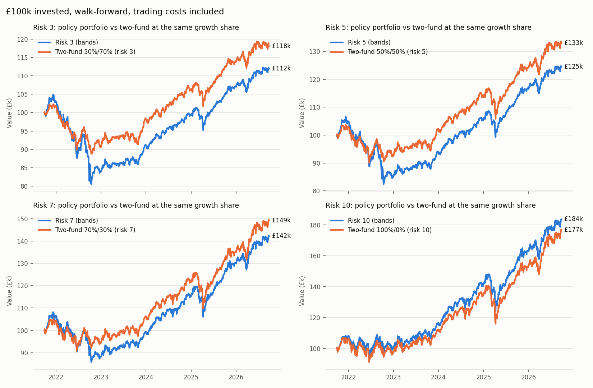
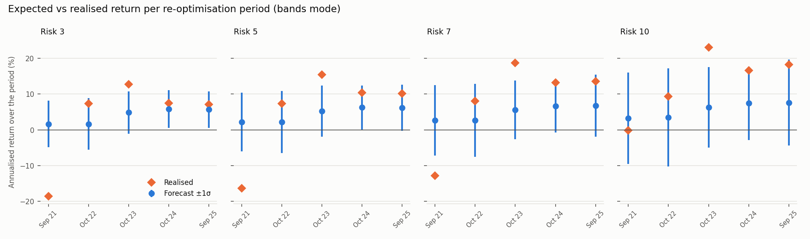

# Walk-forward backtest — policy portfolio construction

Test window **2021-09-27 → 2026-09-25**, £100,000 per run, risk scores 3, 5, 7, 10. Prices: Yahoo Finance daily closes rebuilt as total-return indices, downloaded 2026-09-25T17:29:29+00:00. Generated by `scripts/run_walkforward_backtest.py`; every table below is also a CSV in this folder.

## Settings
- Check every **10 trading days**; targets rebuilt every **12 months**, estimated on up to **10 years** of month-end GBP returns available at the time.
- Trading cost **10 bp** of traded value per fill, plus £0 per fill.
- Modes: **bands** = the app's triggers (holding band min(5pp, 25%×target) with a 1pp floor, portfolio drift ½Σ|drift| > 3%, growth share outside ±5pp); **calendar** = trade to target at every check. Both skip trades below max(£25, 0.25% of value).
- Benchmarks: VWRL.L and GBP-hedged AGBP.L two-fund mixes, run through the same ledger, costs and bands.

## How look-ahead is excluded
- Each decision receives only price rows dated on or before the decision date; the current month's partial return is dropped.
- ETF choice per block: first candidate with ≥ 36 complete month-ends and a price within 10 days *at that date* (the registry's 2026 `delisted` flag is ignored).
- rf = trailing 12-month return of the cash proxy up to the decision date (not today's live rate).
- Orders are sized on day *i*'s close and filled at day *i+1*'s close (sells in units, buys limited to cash raised).
- Data cleaning is causal: dividends reinvested from their ex-date; 100× pence glitches checked against a trailing median; FX (USD lines) uses the last FX print dated before each price.
- `tests/test_walkforward_backtest.py` changes, then deletes, every price after a cut date and checks that every decision, order, fill and portfolio value up to that date is unchanged.

## Performance
| Run | End value | CAGR | Volatility | Sharpe | Max drawdown | Costs (all) | Rebalance costs | Costs bp/yr | Rebalances | Turnover/yr |
|---|---|---|---|---|---|---|---|---|---|---|
| Risk 3 (bands) | £111,974 | 2.3% | 6.4% | -0.13 | -23.3% | £233.19 | £133.19 | 4.8 | 8 | 15.9% |
| Risk 3 (calendar) | £111,223 | 2.2% | 6.4% | -0.15 | -23.6% | £281.80 | £181.80 | 5.9 | 87 | 21.0% |
| Risk 5 (bands) | £124,518 | 4.5% | 7.8% | 0.18 | -22.7% | £289.36 | £189.36 | 5.7 | 11 | 21.2% |
| Risk 5 (calendar) | £124,287 | 4.4% | 7.7% | 0.18 | -22.9% | £356.31 | £256.31 | 7.0 | 103 | 28.0% |
| Risk 7 (bands) | £142,182 | 7.3% | 9.3% | 0.45 | -20.7% | £292.60 | £192.60 | 5.4 | 10 | 20.9% |
| Risk 7 (calendar) | £141,886 | 7.3% | 9.3% | 0.45 | -20.9% | £368.63 | £268.63 | 6.8 | 105 | 28.2% |
| Risk 10 (bands) | £183,724 | 13.0% | 12.2% | 0.79 | -16.3% | £293.77 | £193.77 | 4.6 | 5 | 18.4% |
| Risk 10 (calendar) | £185,111 | 13.1% | 12.2% | 0.80 | -16.2% | £399.60 | £299.60 | 6.2 | 95 | 26.4% |
| VWRL 100% | £176,870 | 12.1% | 13.0% | 0.69 | -17.5% | £100.00 | £0.00 | 1.6 | 0 | 0.0% |
| VWRL/AGBP 60/40 | £140,823 | 7.1% | 8.2% | 0.48 | -13.4% | £131.33 | £31.33 | 2.4 | 6 | 2.7% |
| Two-fund 30%/70% (risk 3) | £118,075 | 3.4% | 5.3% | 0.04 | -13.2% | £126.74 | £26.74 | 2.5 | 6 | 2.5% |
| Two-fund 50%/50% (risk 5) | £132,932 | 5.9% | 7.1% | 0.38 | -13.0% | £135.70 | £35.70 | 2.5 | 7 | 3.2% |
| Two-fund 70%/30% (risk 7) | £149,230 | 8.3% | 9.4% | 0.55 | -13.7% | £128.00 | £28.00 | 2.3 | 5 | 2.3% |
| Two-fund 100%/0% (risk 10) | £176,870 | 12.1% | 13.0% | 0.69 | -17.5% | £100.00 | £0.00 | 1.6 | 0 | 0.0% |

## Forecast accuracy (bands mode)
Forecasts are the portfolio's expected arithmetic return and volatility at each re-optimisation; *realised* is the portfolio's annualised return from the day those trades executed to the next re-optimisation. Coverage counts periods with |realised − expected| ≤ σ/√τ.

| Risk | Forecast E[R] (arith) | Forecast (geo, E−σ²/2) | Realised CAGR | Bias (mean actual − expected) | RMSE | Within ±1σ (calibrated) | Within ±1σ (model) | Realised/predicted vol (model) | Realised/predicted vol (×1.15) |
|---|---|---|---|---|---|---|---|---|---|
| 3 | 3.9% | 3.8% | 2.3% | -0.7% | 10.1% | 60% | 60% | 1.08 | 0.94 |
| 5 | 4.4% | 4.2% | 4.5% | 1.0% | 10.1% | 60% | 60% | 1.13 | 0.99 |
| 7 | 4.8% | 4.5% | 7.3% | 3.3% | 10.3% | 60% | 40% | 1.16 | 1.01 |
| 10 | 5.6% | 5.0% | 13.0% | 7.8% | 10.2% | 80% | 40% | 1.15 | 1.00 |

### Per period
| Risk | Period | rf at decision | Expected (arith) | Predicted vol (×1.15) | Realised (ann.) | Realised vol | Error | z |
|---|---|---|---|---|---|---|---|---|
| 3 | 2021-09-28 → 2022-10-11 | 0.2% | 1.7% | 6.6% | -18.6% | 10.9% | -20.3% | -3.10 |
| 3 | 2022-10-11 → 2023-10-09 | 0.3% | 1.7% | 7.1% | 7.3% | 4.9% | 5.7% | +0.79 |
| 3 | 2023-10-09 → 2024-10-03 | 4.1% | 4.8% | 5.9% | 12.7% | 3.8% | 7.9% | +1.33 |
| 3 | 2024-10-03 → 2025-09-30 | 5.2% | 5.9% | 5.2% | 7.5% | 4.6% | 1.6% | +0.30 |
| 3 | 2025-09-30 → 2026-09-25 | 4.9% | 5.7% | 5.1% | 7.1% | 4.4% | 1.5% | +0.28 |
| 5 | 2021-09-28 → 2022-10-11 | 0.2% | 2.2% | 8.4% | -16.4% | 12.3% | -18.5% | -2.26 |
| 5 | 2022-10-11 → 2023-10-09 | 0.3% | 2.2% | 8.6% | 7.3% | 6.3% | 5.2% | +0.60 |
| 5 | 2023-10-09 → 2024-10-03 | 4.1% | 5.3% | 7.1% | 15.4% | 5.3% | 10.2% | +1.41 |
| 5 | 2024-10-03 → 2025-09-30 | 5.2% | 6.3% | 6.1% | 10.4% | 6.6% | 4.1% | +0.67 |
| 5 | 2025-09-30 → 2026-09-25 | 4.9% | 6.2% | 6.4% | 10.2% | 5.9% | 4.0% | +0.62 |
| 7 | 2021-09-28 → 2022-10-11 | 0.2% | 2.6% | 10.0% | -12.8% | 13.7% | -15.4% | -1.57 |
| 7 | 2022-10-11 → 2023-10-09 | 0.3% | 2.6% | 10.2% | 8.1% | 7.9% | 5.5% | +0.54 |
| 7 | 2023-10-09 → 2024-10-03 | 4.1% | 5.6% | 8.1% | 18.7% | 6.6% | 13.1% | +1.61 |
| 7 | 2024-10-03 → 2025-09-30 | 5.2% | 6.7% | 7.4% | 13.2% | 8.8% | 6.6% | +0.89 |
| 7 | 2025-09-30 → 2026-09-25 | 4.9% | 6.8% | 8.6% | 13.5% | 7.6% | 6.7% | +0.78 |
| 10 | 2021-09-28 → 2022-10-11 | 0.2% | 3.3% | 13.0% | -0.2% | 16.2% | -3.4% | -0.27 |
| 10 | 2022-10-11 → 2023-10-09 | 0.3% | 3.5% | 13.7% | 9.3% | 11.0% | 5.8% | +0.42 |
| 10 | 2023-10-09 → 2024-10-03 | 4.1% | 6.3% | 11.2% | 23.1% | 9.6% | 16.8% | +1.49 |
| 10 | 2024-10-03 → 2025-09-30 | 5.2% | 7.4% | 10.2% | 16.7% | 13.0% | 9.2% | +0.90 |
| 10 | 2025-09-30 → 2026-09-25 | 4.9% | 7.6% | 11.9% | 18.2% | 10.3% | 10.6% | +0.88 |

## Target weights at each re-optimisation
| risk | asset_class | 2021-09 | 2022-10 | 2023-10 | 2024-10 | 2025-09 |
|---|---|---|---|---|---|---|
| 3 | asia_pacific_equity | 0.6% | 0.6% | – | – | – |
| 3 | cash_equivalent | – | 35.0% | 35.0% | 35.0% | 35.0% |
| 3 | commodities_gold | – | – | – | – | 0.9% |
| 3 | corporate_bonds | 20.0% | 13.8% | 20.0% | 19.2% | 19.5% |
| 3 | emerging_market_equity | 1.2% | 1.2% | 1.2% | 1.2% | 1.2% |
| 3 | europe_ex_uk_equity | 4.5% | 4.5% | 4.5% | 4.5% | 4.4% |
| 3 | global_bonds | 30.0% | 15.9% | 15.0% | 15.8% | 15.5% |
| 3 | uk_equity | 3.0% | 3.0% | 3.6% | 3.6% | 3.5% |
| 3 | uk_inflation_linked | 20.0% | 5.3% | – | – | – |
| 3 | us_equity | 20.7% | 20.7% | 20.7% | 20.7% | 20.0% |
| 5 | asia_pacific_equity | 1.1% | 1.1% | – | – | – |
| 5 | cash_equivalent | – | 25.0% | 25.0% | 25.0% | 25.0% |
| 5 | commodities_gold | – | – | – | 2.9% | 5.0% |
| 5 | corporate_bonds | 9.6% | – | 10.2% | 9.1% | 6.7% |
| 5 | emerging_market_equity | 2.0% | 2.0% | 2.0% | 1.9% | 1.8% |
| 5 | europe_ex_uk_equity | 7.5% | 7.5% | 7.5% | 7.1% | 6.8% |
| 5 | global_bonds | 13.1% | 20.6% | 14.8% | 15.9% | 18.3% |
| 5 | uk_equity | 5.0% | 5.0% | 6.0% | 5.7% | 5.4% |
| 5 | uk_gilts | 7.2% | – | – | – | – |
| 5 | uk_inflation_linked | 20.0% | 4.4% | – | – | – |
| 5 | us_equity | 34.4% | 34.4% | 34.4% | 32.4% | 31.0% |
| 7 | cash_equivalent | – | 15.0% | 15.0% | 15.0% | 15.0% |
| 7 | commodities_gold | 2.2% | 5.0% | 5.0% | 5.0% | 5.0% |
| 7 | corporate_bonds | – | – | 2.5% | – | – |
| 7 | emerging_market_equity | 4.3% | 2.6% | 2.6% | 2.6% | 2.6% |
| 7 | europe_ex_uk_equity | 10.0% | 9.8% | 9.8% | 9.8% | 9.8% |
| 7 | global_bonds | – | 15.0% | 12.5% | 15.0% | 15.0% |
| 7 | japan_equity | – | 0.9% | – | – | – |
| 7 | uk_equity | 6.8% | 7.0% | 7.9% | 7.9% | 7.9% |
| 7 | uk_gilts | 11.1% | – | – | – | – |
| 7 | uk_inflation_linked | 18.9% | – | – | – | – |
| 7 | us_equity | 46.7% | 44.8% | 44.8% | 44.8% | 44.8% |
| 10 | commodities_gold | 5.0% | 5.0% | 5.0% | 5.0% | 5.0% |
| 10 | emerging_market_equity | 8.1% | 8.9% | 3.8% | 3.8% | 3.8% |
| 10 | europe_ex_uk_equity | 11.9% | 4.8% | 13.9% | 14.3% | 14.2% |
| 10 | japan_equity | – | 6.4% | 2.3% | – | – |
| 10 | uk_equity | 9.5% | 9.5% | 9.5% | 11.5% | 15.7% |
| 10 | us_equity | 65.5% | 65.5% | 65.5% | 65.5% | 61.2% |

## Remaining biases (disclosed)
- **Survivorship:** CORE_UNIVERSE and its fallback order were chosen in 2026 from funds that exist today; TERs are today's registry values. The point-in-time fallback reduces, but cannot remove, this.
- **Design-time (hyperparameter) leakage:** the covariance settings (EWMA half-life 12, 50/50 EWMA/Ledoit-Wolf) and the ×1.15 volatility calibration were chosen in 2026 on 2016–2026 data that overlaps this window (docs/OPTIMIZATION_WALKTHROUGH.md, risks R2/R5). The ×1.15 only rescales the *reported* volatility, so it affects the 'calibrated' coverage figures, not the weights; the covariance settings do shape the weights. Policy constants (λ = 2.5, reference weights, bands) come from the literature, not from fitting.
- **Execution:** fills at the closing price plus a flat 10 bp; no market impact, bid-ask variation or partial fills. Uninvested cash earns nothing.
- **Data:** Yahoo closes and dividends are not audited against issuer data; dividends are reinvested gross (no withholding or UK tax) on the ex-date.
- **Sample:** five annual periods per risk level — coverage and bias are indicative, not significant.

## Files
`summary.csv`, `accuracy_summary.csv`, `accuracy_periods.csv`, `asset_accuracy.csv`, `decisions.csv`, `events.csv` (every rebalance: reason, buys/sells £, cost £), `fills.csv` (every trade), `checks.csv` (every 10-day check with drift diagnostics), `equity.csv` (daily values).
